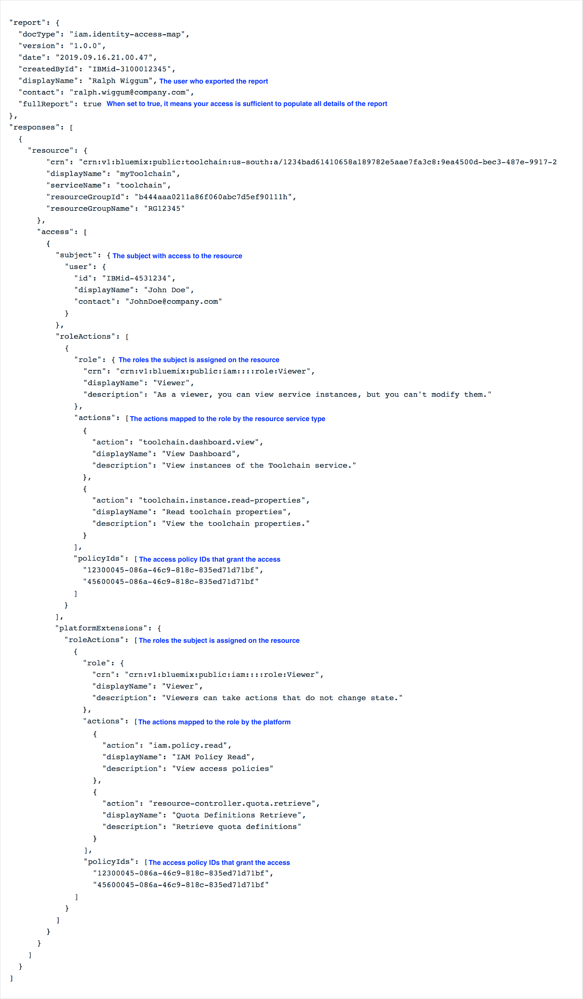

---

copyright:

  years: 2018, 2019
lastupdated: "2019-10-17"

keywords: resource access, access report, export user access, who has access, download access report

subcollection: resources

---

{:shortdesc: .shortdesc}
{:codeblock: .codeblock}
{:screen: .screen}
{:new_window: target="_blank"}
{:tip: .tip}
{:note: .note}
{:external: target="_blank" .external}

# Exporting an access report for a resource
{: #access-report}

If you want to determine which users, access groups, service IDs, and services can access a specific resource, you can download a report in JSON format. Each report includes all the entities that can access the resource at the time you download the report.
{: shortdesc}

The report includes details about the selected resource. It doesn't include details about its sub-resources. However, the access listed in the report might extend to the sub-resources.
{: note}

## Required access
{: #required-access-report}

You can download the report if you have the Administrator role on the selected resource. If you have administrator access only on the resource, the report displays the IDs for the users, access groups, and services. However, you can't view the display names of the users, services, access groups, or the access group members or dynamic rules.

With the following extra access, you can view display names, access group membership, and dynamic rules in the report:

* You must be a member of the account. If the account owner restricts the user list, you might be able to view only the users that you have access to view.
* You must have access to the access group to view the members of the group who have access. This includes any of the following types of access:
   * Viewer role for a specific access group through the IAM Access Groups account management service
   * Viewer role for all access groups through the IAM Access Groups account management service
   * Viewer role for all account management services

## Exporting a report
{: #export-report} 

To export the report, complete the following steps:

1. Go to the Resource list page.
2. From the Actions menu for the row of the resource that you want a report for, click **Export access report**.
3. Click **Download JSON**.

Depending on your assigned access, you might be able to view just the IDs, or you might have the full detailed view, including user names, access group names, access group memberships, and dynamic rules. Check the value that is set for `fullReport` flag. If it is set to `false`, then you don't have full access to view all display names, memberships, or rules.
{: note}

## Example
{: #example-report}

The report includes the following types of information:

* Resource display name
* The information for the user who exported the report
* A flag called `fullReport` that indicates if you have access to view the full detailed report, which includes user names, group memberships, and rules. When this attribute is set to `true`, the user who downloaded the report has all of the required access.
* Any subjects who have access to the resource, including the roles and actions mapped to each role by the service and the platform. Actions that are mapped to the role by the specific service are separated from the platform-specific actions that are mapped to the role. 
* The IDs of the policies that provide the access.

For a simplified preview, see the following JSON example with comments added to help you understand the structure of the report.

